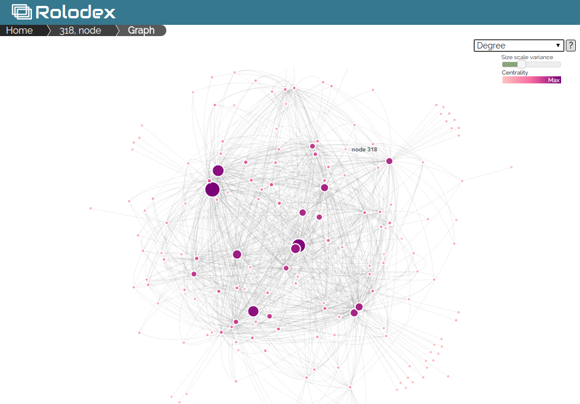

=======
Rolodex
=======

Rolodex is a directory of people and the organizations they belong to. It's also a space where you can model relationships.

At _The News_ we use it as a drop-in backend for projects that require us to manage relationships between people and organizations. We also maintain our contacts with it on a dedicated app.

The stand-alone app provides a clean, intuitive interface for our reporters to enter and search basic information about people and orgs and the relationships between them, while the API and django plug-in lets us cut out quick graphs of related entities.

This is a development release, with more detailed docs, annotated (and probably cleaner) code and other niceties on the way. Suggestions for features are welcome.

Quick start
-----------
- `pip install django-rolodex`
- Add rolodex and the django rest framework to your `INSTALLED_APPS` setting:
```python
INSTALLED_APPS = (
    ...
    'rolodex',
    'rest_framework',
)
```
- Include the rolodex and rest framework auth URLconf in your project urls.py:
```python
urlpatterns = patterns('',
    ...
    url(r'^rolodex/', include('rolodex.urls')),
    url(r'^api-auth/', include('rest_framework.urls', namespace='rest_framework')),
)
```
- If you'd like to restrict views to only logged in users, set Rolodex's security variable in settings.py:
```python
ROLODEX_SECURE = True 
```
Also add django's auth views to your project's urls.py:
```python
urlpatterns = patterns('',
    ...
    url(r'^accounts/login/$', 'django.contrib.auth.views.login', {'template_name':'admin/login.html'}),
    url(r'^accounts/logout/$', 'django.contrib.auth.views.logout'),
)
```
It's also a good idea to set django rest framework's auth to django model permissions in settings.py. You may also add anonymous read only like this:
```python
REST_FRAMEWORK = {
    'DEFAULT_PERMISSION_CLASSES': [
	'rest_framework.permissions.DjangoModelPermissionsOrAnonReadOnly'
    ]
}
```
- Optionally, create a `'rolodex'` database in your DATABASES settings or use a `ROLODEX_DB` environment variable (à la  `DATABASE_URL`) to route the app to a dedicated database. __REMEMBER:__ Django does not support [cross-database relationships](https://docs.djangoproject.com/en/dev/topics/db/multi-db/#cross-database-relations), so forget foreign keys. Instead, we often just use the built in API.
- Run `python manage.py migrate` (or `python manage.py migrate --database=rolodex` if you set up routing) to create the models and load fixtures.
- `python manage.py runserver` and checkout [http://localhost:8000/rolodex](http://localhost:8000/rolodex) to create your first people and orgs (see docs). 
- Optionally, use the rest framework API at [http://localhost:8000/rolodex/api/](http://localhost:8000/rolodex/api/)


Adding people & orgs to Rolodex
--------------------------------
People and orgs can easily be added through Rolodex. 

Rolodex forces users to choose the primary organization a person belongs to before they can be created. This relationship is set as type `'employment'`, which is pre-loaded as a [p2org](#types_and_roles) relationship type fixture.

Developers can also use the RESTful API to create people, orgs and their relationships and contact details. Browse the API to see what parameters can be passed when creating objects.

The API uses Django rest framework's hyperlinked serializers, so use URLs for foreign keys.


Deleting people & orgs
----------------------
Users must have explicit permission to delete people and organizations.

These can be added in the admin for individual users or groups:
- `rolodex | org | Can delete org`
- `rolodex | person | Can delete person`


Relationships
-------------
Relationships in Rolodex are undirected (facebook not twitter), so when you create a relationship from one person or org to another person or org, the relationship is reciprocally created the other way. 

There are different relationship models for each permuation of person/org relationship, e.g. person-to-person,person-to-org, etc.

To help manage the creation of relationships, person and org objects have an extended set of methods.

- `add_p2p(person_object,**kwargs)` : relationship from person to person
- `remove_p2p(person_object,**kwargs)`
- `add_p2org(org_object,**kwargs)` : relation from person to org
- `remove_p2org(org_object,**kwargs)`
- `add_org2org(org_object,**kwargs)` : relation from org to org
- `remove_org2org(org_object,**kwargs)`
- `add_org2p(person_object,**kwargs)` : relation from org to person
- `remove_org2p(person_object,**kwargs)`

Org2Org relationships are allowed hierarchy. Pass the `hierarchy` parameter `parent` or `child` when creating the relationship, referencing the current object, and the related node's symmetrical relationship will receive the inverse property. 

For example, if org1 is parent to org2, `org1.add_org2org(org2,**{hierarchy:'parent'})` will create the relationship with the correct hierarchy. 

__Note__: If you modify an existing Org2Org relationship's hierarchy, a duplicate will be created. Instead delete the current relationship and re-create it with the correct hierarchy.

There are also shorthand methods for retrieving related objects:

- `get_relations()` : gets related person & org objects
- `get_relations_with_type()` : gets related person & org objects with type of relationship
- `get_relations_by_type(type)` : related objects filtered by type name (a string)
- `get_employer()` : primary orgs associated with person object
- `get_employees()` : gets person objects primarily associated with org
- `get_employees_by_role(role)` : role is a string
- `get_children()` : get children in Org2Org relationships
- `get_parents()` : get parents in Org2Org relationships


<a name="types_and_roles"></a>Types & Roles
-------------
You can classify people, org contacts and relationships in Rolodex, so it's easy to create custom filters for how you want to organize your networks. Usually, the more generic, the more useful the type or role, but that is up to you and your project's needs. Remember, that all relationships are created symmetrically.

Types and roles are added through django admin:
- `Role` : specific to person objects, e.g., "chief information officer"
- `OrgContactRole` : of an org contact, e.g., "information desk" or "mailing address"
- `P2P_Type` : relationship between people, e.g., "spouse" or "professional"
- `Org2Org_Type` : relationships between orgs, e.g., "co-venture" or "subsidiary"
- `P2Org_Type` : relationships between people and orgs, where "employment" is a pre-loaded fixture.

Analysis
---------

Rolodex person and org objects also have methods to return a [NetworkX](http://networkx.github.io/) graph of connected objects for more advanced analysis.

`nx_graph(hops=2)` returns a NetworkX graph of all person and org objects within a specified number of hops.

See the [NetworkX documentation](http://networkx.github.io/documentation/latest/reference/index.html) for the methods available on the returned graph.

The "Full Page Graph" for each person or org, also provides a quick and dirty visualization of centrality measures for a graph N hops from the origin node. You can pass the number of hops as a GET parameter, e.g. `?hops=4`, or it will default to 3.

